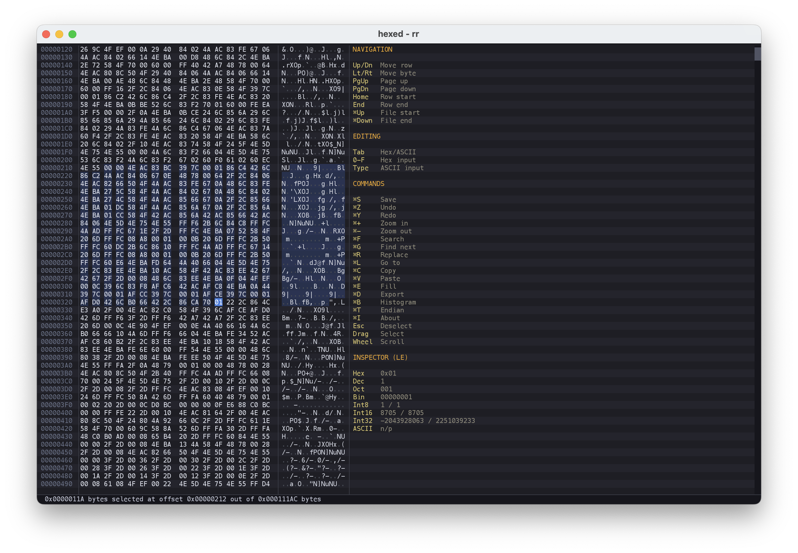
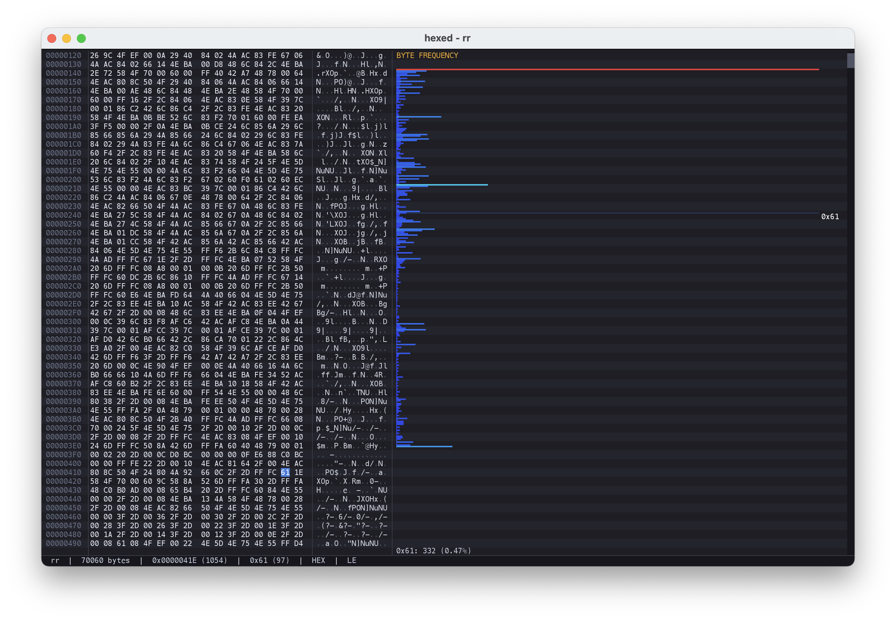

# Hexed

<p>
  
  
</p>

A hex editor for macOS and Linux. Written in Modula-2, compiled and built with the [m2c](https://github.com/fitzee/m2c) compiler toolchain.

There's a popular claim that Modula-2 is a terrible choice for AI-assisted development -- that coding agents can't work with it, that the tooling isn't there, that you'd be fighting the model every step of the way. This project exists in part to push back on that idea. Every module in hexed was written with an AI coding agent (Claude Code), from the byte store and undo system up through the SDL2 rendering, search engine, data inspector, and ObjC bridge for the macOS About dialog. The agent handled Modula-2's strict type system, its separation of definition and implementation modules, C FFI bindings, and the kind of low-level byte manipulation that a hex editor demands. It didn't struggle with the language. It worked with it.

The reality is that a well-structured language with clear semantics and strong compile-time checks is exactly what you want when an agent is writing code. The compiler catches mistakes immediately. The module system enforces boundaries. There's no ambiguity about what a procedure signature means. Modula-2 turns out to be a remarkably good fit for this workflow -- not in spite of being a strict, old-school systems language, but because of it.

Hexed displays files as hex, ASCII, and binary simultaneously, with a data inspector, byte histogram, search and replace, undo/redo, and mouse-driven selection. It renders through SDL2 with a dark theme and monospace layout. Files up to 64MB are loaded entirely into memory. Larger files use a paged backend that lazily loads 4KB pages through a 256-page LRU cache, so you can open multi-gigabyte files without waiting for the whole thing to load.

## Building

You need [m2c](https://github.com/fitzee/m2c) installed, plus SDL2 and SDL2_ttf.

**macOS:**
```
brew install sdl2 sdl2_ttf
```

**Debian/Ubuntu:**
```
sudo apt install libsdl2-dev libsdl2-ttf-dev
```

Then build and run:

```
m2c build
.m2c/bin/hexed somefile.bin
```

On macOS, use `--feature MACOS` to enable the native About dialog and Cocoa integration:

```
m2c build --feature MACOS
```

### Font

Hexed bundles DejaVu Sans Mono in `resources/fonts/` for consistent cross-platform rendering. If the bundled font is not found, it falls back to platform-specific system fonts (Menlo on macOS, DejaVu/Liberation/Ubuntu Mono on Linux). If no font is found, the app exits with a message explaining how to provide one.

### macOS App Bundle

To build a macOS `.app` bundle:

```
bash build_app.sh
```

This creates `.m2c/Hexed.app`. You can drag files onto it in Finder, use "Open With", or double-click it to get a file picker dialog. You can also launch it from the terminal:

```
open .m2c/Hexed.app --args somefile.bin
```

To package a distributable DMG:

```
bash build_app.sh --dmg
```

This creates `.m2c/Hexed-1.0.0.dmg` with the standard drag-to-Applications layout.

## The Interface

The window is divided into four columns: offset addresses, the hex grid (16 bytes per row, split into two groups of 8), the ASCII column (printable characters or dots), and a side panel showing either a help reference with data inspector or a byte histogram.

The status bar along the bottom shows the filename, file size, cursor position, byte value, edit mode, endianness, and modification state. When bytes are selected, it shows the selection size and offset instead.

The data inspector panel displays the byte at the cursor in hex, decimal, octal, and binary, along with signed/unsigned Int8, Int16, and Int32 interpretations (endian-aware) and the ASCII character if printable. Click individual bits in the binary row to enter binary editing mode.

## Keyboard Reference

### Navigation

| Key | Description |
|-----|-------------|
| Arrows | Move by one byte or row |
| Page Up / Down | Move by one page |
| Home / End | Jump to row start / end |
| Cmd+Up / Down (Ctrl on Linux) | Jump to file start / end |
| Scroll wheel | Scroll view without moving cursor |

Click any byte in the hex or ASCII columns to jump there. Click and drag or shift+arrow to select ranges.

### Editing

| Key | Description |
|-----|-------------|
| 0-9, A-F | Hex nibble input (hex mode) |
| Typing | ASCII character input (ASCII mode) |
| 0 / 1 | Bit input (binary mode) |
| Tab | Toggle hex / ASCII mode |
| Escape | Clear selection, exit binary mode |

Hex mode takes two keystrokes per byte (high nibble, low nibble). Binary mode is entered by clicking a bit in the inspector; left/right arrows move between bits, wrapping across byte boundaries.

### Commands

Cmd on macOS, Ctrl on Linux.

| Key | Description |
|-----|-------------|
| Cmd/Ctrl+S | Save |
| Cmd/Ctrl+Z | Undo |
| Cmd/Ctrl+Y | Redo |
| Cmd/Ctrl+F | Search -- hex or ASCII pattern, Tab to switch; Return to find, Escape to cancel |
| Cmd/Ctrl+G | Find next match |
| Cmd/Ctrl+R | Replace -- three phases: search, replacement, confirm (Y/N/A/Escape) |
| Cmd/Ctrl+L | Go to hex offset |
| Cmd/Ctrl+C | Copy selection as hex pairs (`4F A3 FF`) |
| Cmd/Ctrl+V | Paste -- auto-detects hex pairs vs raw ASCII; overwrites in place |
| Cmd/Ctrl+E | Fill selection with a hex byte value |
| Cmd/Ctrl+D | Export selection to a file |
| Cmd/Ctrl+B | Toggle byte frequency histogram |
| Cmd/Ctrl+T | Toggle little-endian / big-endian interpretation |
| Cmd/Ctrl+Plus | Zoom in |
| Cmd/Ctrl+Minus | Zoom out |

All multi-byte operations (paste, fill, replace-all) are grouped into a single undo step. Replace overwrites in place and never changes the file size. The histogram shows all 256 byte values color-coded from blue (rare) to red (frequent), with the cursor byte highlighted and its count/percentage in a footer.

## Architecture

Hexed is structured as three layers, enforced by Modula-2's module system. Each layer only depends downward — no circular imports.

### Core (`src/core/`)

The data layer. No UI or rendering knowledge.

- **ByteStore** — Abstract byte storage with two backends selected at open time based on file size. Files up to 64MB use a **memory backend** that loads the entire file into a `ByteBuf`. Larger files use a **paged backend** with lazy 4KB page loading, a 256-page LRU cache (1MB resident), and `fseek`-based random access. A `lastSlot` cache makes sequential access patterns (search, histogram) O(1) per byte for page lookup instead of scanning all 256 cache entries. `ReadBlock` provides bulk 4KB reads to eliminate per-byte function call overhead for scan-heavy operations.
- **Doc** — Document model. Wraps ByteStore and owns cursor position, selection state, edit mode, nibble phase, and visible row tracking. Provides the byte access API that the rest of the app uses. Rejects files over 4GB (CARDINAL range) at open time using a 64-bit size pre-check.
- **Cmd** — Undo/redo engine. Records `SetByte` operations into a ring buffer. Supports operation grouping so multi-byte edits (paste, fill, replace-all) collapse into a single undo step.
- **Search** — Byte-pattern search engine. Supports hex byte patterns and ASCII string search with wrap-around. Uses bulk `ReadBlock` to scan 4KB blocks at a time with overlap to catch patterns at page boundaries.
- **Sys** — C FFI shim (`DEFINITION MODULE FOR "C"`). Exposes handle-based file I/O (`fopen`/`fclose`/`fread`/`fwrite`/`fseek`), 64-bit `file_size`, `basename`, and `file_exists` from the m2sys C library.

### UI (`src/ui/`)

Presentation and input handling. Depends on Core and the m2gfx graphics library.

- **View** — All rendering. Draws the hex grid, ASCII column, offset addresses, data inspector, histogram, status bar, search/replace overlays, and scrollbar. Converts byte values to hex display using a `HexDigit` constant string indexed by `DIV 16` / `MOD 16`.
- **Keymap** — Event dispatch. Maps keyboard and mouse events to document operations. Handles modal input states (search, goto, fill, replace, export). Computes the byte frequency histogram using bulk block reads.
- **App** — Main loop. Initializes SDL2, resolves and loads fonts, runs the event/render loop at 60fps with idle-wait, handles window resize.
- **Theme** — Color palette and layout constants. Dark theme with configurable zoom.
- **State modules** (SearchState, GotoState, FillState, ReplaceState, ExportState, HistogramState, EndianState) — Shared mutable state for modal UI. These exist to break what would otherwise be circular dependencies between Keymap (writes state) and View (reads state).
- **FontResolve** — Cross-platform font resolution. Checks bundled font, then platform-specific system paths.
- **Platform** — C FFI for platform detection (`platform_is_macos`).
- **MacBridge** — ObjC FFI for the native macOS About dialog (macOS only, gated by `(*$IF MACOS *)`).

### App (`src/app/`)

- **Main** — Entry point. Parses command-line arguments, calls `App.Run`.

### External Dependencies

- **m2gfx** — SDL2 graphics abstraction (Gfx, Font, Canvas, Events). Backed by `gfx_bridge.c` which wraps SDL2 and SDL2_ttf.
- **m2bytes** — `ByteBuf` growable byte buffer with geometric growth, used by the memory backend.
- **m2sys** — C shim library for file I/O, path utilities, and system calls.

### Design Choices

**Two-tier storage.** Small files get the simplicity of a flat in-memory buffer. Large files get lazy paging without loading the whole file. The threshold (64MB) is high enough that most files people hex-edit fit in memory, but the paged path means multi-gigabyte files open instantly.

**Page cache with sequential fast-path.** The 256-page LRU cache keeps 1MB resident for the paged backend. A `lastSlot` hint avoids linear cache scans for sequential access — the common case for search, histogram, and scroll rendering. Bulk `ReadBlock` returns up to one page of data per call, letting callers process 4KB at a time instead of issuing per-byte requests through the full call chain.

**State modules for modal UI.** Modula-2 forbids circular imports. Search, replace, goto, fill, and histogram all need state written by the event handler and read by the renderer. Dedicated state modules with getter/setter pairs act as a shared mailbox, keeping Keymap and View independent.

**No heap allocation in the hot path.** Rendering, search, and histogram use stack-allocated buffers. The only heap allocation is ByteBuf for the memory backend (one allocation at file open). The paged backend's 256-page array lives in the Store record itself.

**C FFI via `DEFINITION MODULE FOR "C"`.** Sys.def declares C functions with Modula-2 signatures. The compiler emits direct C calls with no wrapper overhead. This is used for file I/O (`m2sys`), graphics (`gfx_bridge`), and the macOS native bridge (`mac_bridge`).

## License

MIT
